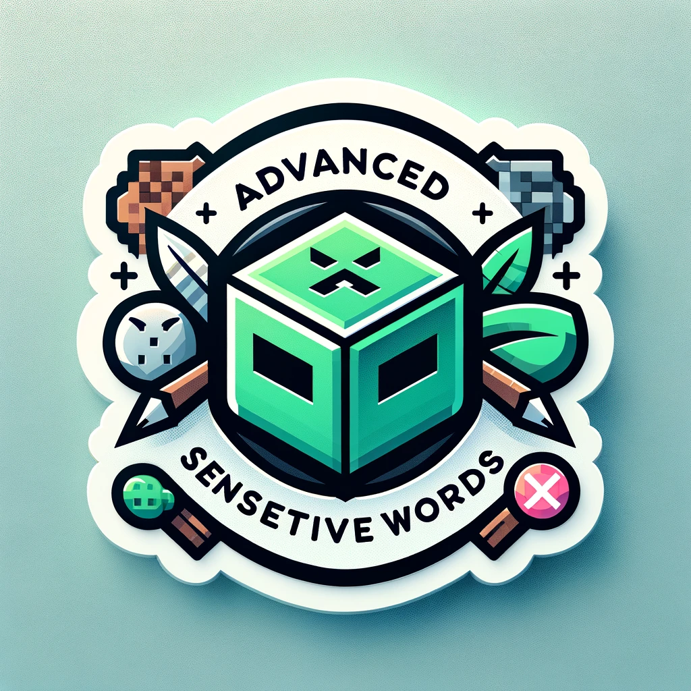

# AdvancedSensitiveWords(高级敏感词)(BungeeCord)
您Minecraft服务器的一站式终极反脏话/敏感词解决方案!

[English](https://github.com/hahawth/AdvancedSensitiveWordsBungee)
[简体中文](https://github.com/hahawth/AdvancedSensitiveWordsBungee/blob/main/README_zh.md)

  

Logo 由 GPT-4 生成

 

*本仓库为BungeeCord版本, 如需Spigot版本请前往 [AdvancedSensitiveWords](https://github.com/hahawth/AdvancedSensitiveWords)*

## 功能
1. 使用DFA(确定性有穷自动机) 算法
2. 预配置 简洁明了,开箱即用
3. 高质量的超大默认敏感词库 (60000+ 敏感词)
4. 运行在数据包层, 不会干扰其他聊天插件 (在2c2g的服务器上能做到3.2w qps)
5. 高度自定义的配置
6. **聊天上下文检测✨**
7. **缓存书内容, 提升效率**
8. 支持检测Emoji等其他Unicode字符
9. 中文支持
10. 基于自定义数据结构的高速处理
11. 支持加载自定义在线词库 ([我们的在线词库](https://github.com/HaHaWTH/ASW-OnlineWordList))
12. **假消息支持(灵感来自 [Bilibili 阿瓦隆系统](https://github.com/freedom-introvert/Research-on-Avalon-System-in-Bilibili-Comment-Area))**

**我们的目标: 干掉ChatSentry!(迫真)**

## 指令

`/aswb help` - 显示帮助

`/aswb reload` - 重载配置和词库

`/aswb status` - 显示当前插件状态

`/aswb test <文本>` - 测试插件检测效果

## 权限

`advancedsensitivewords.bypass` - 绕过检测

`advancedsensitivewords.reload` - 允许使用重载配置和词库命令

`advancedsensitivewords.status` - 允许使用status命令

`advancedsensitivewords.test` - 允许使用test命令

## 统计数据

## 赞助
如果您喜欢这个项目, 请我喝杯迎宾酒罢(喜)!

[爱发电](https://afdian.net/a/114514woxiuyuan)
